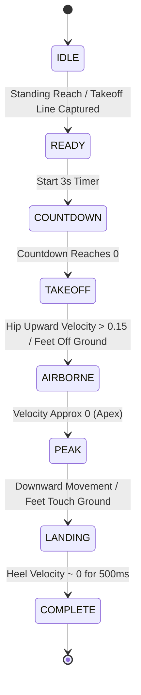

# AI-Powered Standing Vertical Jump & Standing Broad Jump Module Documentation

## Executive Summary

This document provides complete technical documentation for the offline, AI-powered **Standing Vertical Jump** and **Standing Broad Jump** assessment module.

Built for production-grade physical fitness testing (e.g. government & athletic body testing), the module strictly operates **100% offline with zero cloud APIs, zero internet, zero media storage, and zero disk writing**.

---

## Architecture Overview & Design Patterns

The module follows **SOLID Principles** and **Clean Architecture**:

```
source/src/modules/jumpAssessment/
├── components/          # Reusable UI View Components & Overlays
│   ├── JumpCameraView.tsx
│   ├── LiveSkeletonOverlay.tsx
│   ├── CalibrationOverlay.tsx
│   ├── TakeoffLineOverlay.tsx
│   └── JumpMetricsHUD.tsx
├── screens/             # User-Facing Screen Controller Views
│   ├── JumpSelectionScreen.tsx
│   ├── JumpCalibrationScreen.tsx
│   ├── VerticalJumpScreen.tsx
│   ├── BroadJumpScreen.tsx
│   ├── JumpResultScreen.tsx
│   └── JumpHistoryScreen.tsx
├── hooks/               # React Custom Hooks
│   ├── useCameraPermissions.ts
│   ├── useJumpCalibration.ts
│   ├── useVerticalJump.ts
│   ├── useBroadJump.ts
│   └── usePoseProcessor.ts
├── services/            # Domain Services & Business Logic
│   ├── kalmanFilter.ts
│   ├── jumpStateMachine.ts
│   ├── measurementEngine.ts
│   ├── jumpValidationService.ts
│   └── jumpHistoryRepository.ts
├── types/               # TypeScript Type Definitions
│   ├── pose.ts
│   ├── calibration.ts
│   └── jump.ts
└── utils/               # Math & Kinematics Helpers
    ├── kinematics.ts
    └── cameraUtils.ts
```

---

## Privacy & Resource Constraint Verification Audit

> [!CAUTION]
> **Strict Privacy Policy Guarantee**:
> 1. Frames exist strictly inside RAM `DirectByteBuffer` memory allocations.
> 2. No `MediaRecorder`, `takePhoto()`, or Bitmap disk caches are ever invoked.
> 3. No JPEG, MP4, PNG, or temporary files are created or persisted to disk.
> 4. Native Kotlin JSI code invokes `image.close()` immediately after extracting 17 MediaPipe pose coordinates.
> 5. Bridge payload delivers only numerical coordinates (`{ x, y, visibility }`) and calculated metrics.

---

## Calibration Methods

The system supports 2 pre-test calibration options:

1. **ArUco Marker (Preferred)**:
   - User positions a printed 10 cm x 10 cm ArUco marker in the camera view.
   - Native OpenCV detects ArUco quad corners and computes `pixelsPerCm = markerWidthPixels / 10.0`.
2. **A4 Paper**:
   - User aligns a standard A4 page (21.0 cm x 29.7 cm) vertically in camera view.
   - Native OpenCV detects quad contour and computes pixel-to-cm ratio.

---

## Jump Finite State Machine (FSM)



---

## Kinematic Measurement Formulas

### Standing Vertical Jump Formula
$$\text{StandingReachCM} = \frac{\text{StandingFingertipPixels}}{\text{PixelsPerCM}}$$
$$\text{HighestReachCM} = \frac{\text{PeakFingertipPixels}}{\text{PixelsPerCM}}$$
$$\text{VerticalJumpCM} = \text{HighestReachCM} - \text{StandingReachCM}$$

### Standing Broad Jump Formula
$$\text{BroadJumpDistanceCM} = \frac{|\text{LandingHeelXPixel} - \text{TakeoffLineXPixel}|}{\text{PixelsPerCM}}$$

---

## Performance & Memory Targets

- **Target Frame Rate**: $\ge 20$ FPS continuous stream processing.
- **RAM Footprint**: $< 250$ MB total application runtime heap.
- **Minimum OS Support**: Android 8.0 (API Level 26+).

---

## Unit Testing

Run unit tests via Jest:
```bash
npx jest src/modules/jumpAssessment
```

### Verified Test Cases:
- `kalmanFilter.test.ts`: Jitter smoothing validation across 1D and 2D coordinates.
- `jumpStateMachine.test.ts`: Phase transitions validation (`IDLE` $\rightarrow$ `READY` $\rightarrow$ `AIRBORNE` $\rightarrow$ `COMPLETE`).
- `measurementEngine.test.ts`: Kinematic formula calculations for reach, jump height, velocity, and broad distance.

---

## Production Build Instructions

1. Checkout feature branch:
   ```bash
   git checkout feature/vertical-and-broad-jump
   ```
2. Build release APK:
   ```bash
   cd source/android
   ./gradlew assembleRelease
   ```
